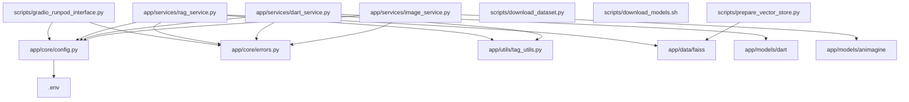
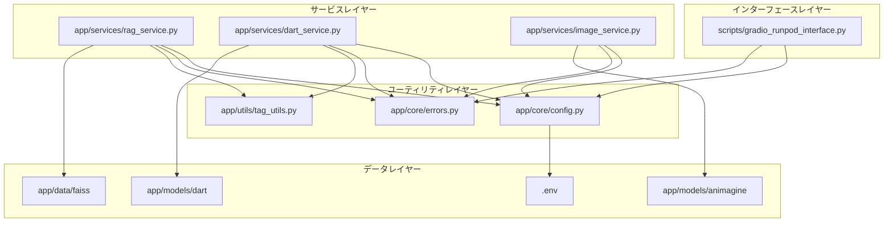
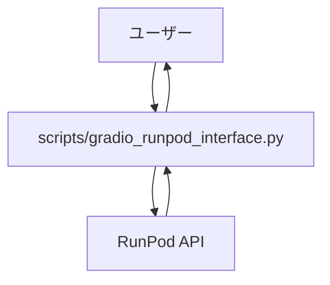
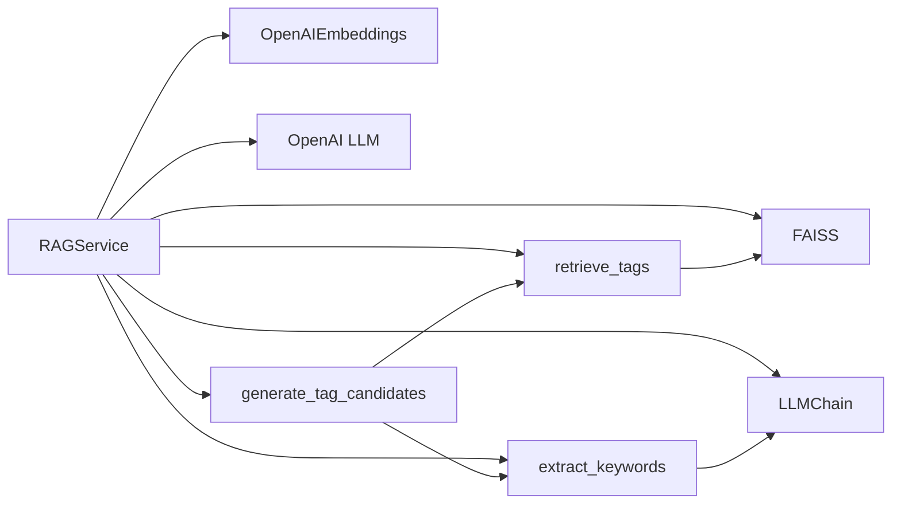
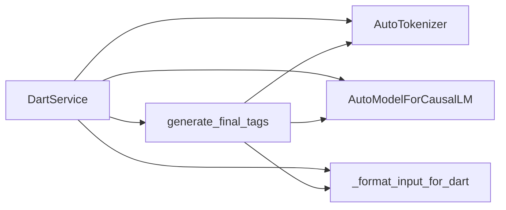
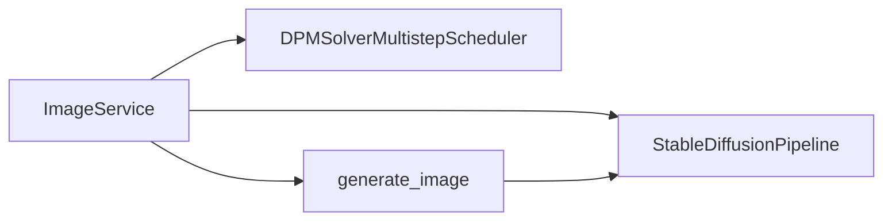
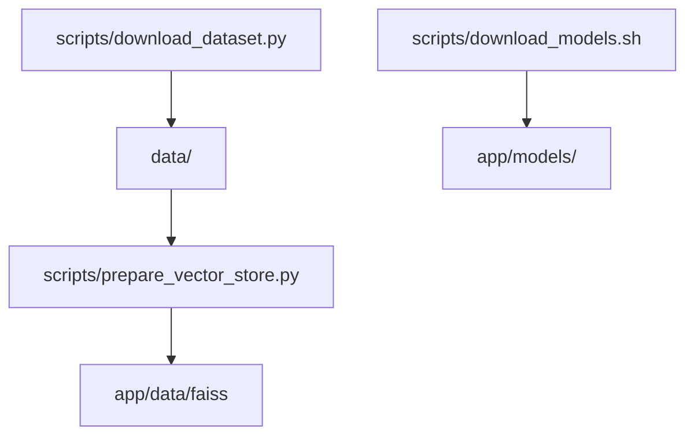

# SotaiGenerator - ファイル依存関係図

本ドキュメントでは、SotaiGeneratorプロジェクトのファイル間の依存関係をグラフ形式で示します。これにより、コードベースの構造と各コンポーネント間の関係を視覚的に理解できます。

## 全体依存関係図

以下の図は、主要ファイル間の依存関係を示しています。矢印は「依存する方向」を示しており、例えば A → B は「AがBに依存している」ことを表します。

## レイヤー別依存関係図

プロジェクトのレイヤーアーキテクチャを示す依存関係図です。

## 主要処理フローの依存関係

画像生成プロセスの主要フローに関わるファイルの依存関係を示します。

## サービスコンポーネントの内部依存関係

各サービスコンポーネント内部の依存関係を示します。

### RAGサービス

### Dartサービス

### 画像生成サービス

## スクリプトと初期化関連

初期化スクリプトとデータ準備に関連するコンポーネントの依存関係です。

## 注意事項

- 上記の図はファイル間の主要な依存関係を示しています。実際のコードベースでは、ここに示されていない副次的な依存関係が存在する場合があります。
- モジュールレベルではなく、関数やクラスレベルの詳細な依存関係は含まれていません。
- 外部ライブラリ（Gradio、RunPod API等）への依存関係は、簡潔さのために図には含まれていません。

## 依存関係分析の活用方法

このファイル依存関係図は以下のような場面で活用できます：

1. **新規開発者のオンボーディング** - コードベースの全体像をすばやく理解
2. **リファクタリング計画** - 変更の影響範囲を把握
3. **テスト戦略** - 依存関係に基づくテスト対象の特定
4. **モジュール分割** - 高凝集・低結合を実現するためのモジュール境界の検討
5. **技術的負債の特定** - 過剰な依存関係や循環依存などの問題箇所の発見 